# BaseFramework

STM32H750 嵌入式基础框架 + 电子负载应用。  
基于 **CubeMX + HAL + FreeRTOS (CMSIS-RTOS V2) + Keil MDK**，应用从外部 QSPI Flash **XIP** 运行。

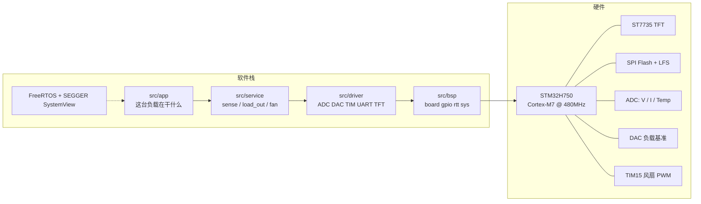

---

## 特性一览

| 类别 | 内容 |
|------|------|
| MCU | STM32H750VBTx · Cortex-M7 · 480 MHz · LQFP100 |
| OS | FreeRTOS V10.3.1 · CMSIS-RTOS V2 · heap_4 · 1 kHz tick |
| 运行方式 | 内部 Bootloader + **QSPI XIP**（App @ `0x90000000`） |
| 调试 | USART1 Shell · RTT 日志 · SEGGER SystemView |
| HMI | ST7735 TFT · MujicaUI · 四向按键 |
| 应用 | 电子负载 CC/CV/CR/CP（实验板级） |

---

## 软件分层

手写代码全部在 `src/`。`Core/` 是 CubeMX 生成的 HAL/RTOS 启动，只留入口调用。

```
app      这台负载在干什么     →  src/app/
service  领域能力             →  src/service/
driver   外设驱动             →  src/driver/
bsp      板级平台             →  src/bsp/
mcu      Cube 生成的芯片启动   →  Core/ + Drivers/ + Middlewares/
```

`src/lib/` 是库（PID、滤波、shell、lfs、GFX…），不当一层。

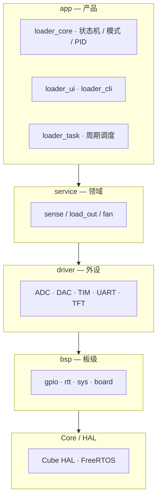

| 层 | 一句话 | 放什么 |
|----|--------|--------|
| **app** | 这台负载 | 模式、状态机、UI、CLI、任务 |
| **service** | 领域能力 | V/I/℃、DAC 映射、风扇、shell、存储 |
| **driver** | 外设驱动 | ADC、DAC、TIM、UART、TFT、SPI Flash |
| **bsp** | 板级平台 | board、GPIO、RTT、sys 日志/时间 |
| **lib** | 库（不当层） | PID、滤波、GFX、shell body、lfs、sfud |

依赖方向：`app` → `service` → `driver` → `bsp` → Core/HAL。`lib` 不当一层。下层与 lib 不准 include `app/`。

---

## 目录结构

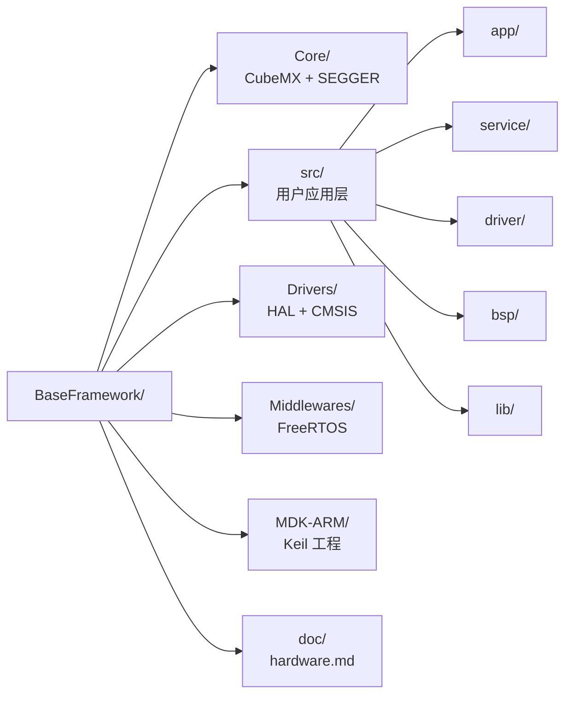

```
BaseFramework/
├── Core/                 ← CubeMX 管理：HAL、FreeRTOSConfig、外设、SEGGER
├── Drivers/              ← 只读：STM32H7 HAL + CMSIS
├── Middlewares/          ← 只读：FreeRTOS 内核
├── MDK-ARM/              ← Keil 工程、启动文件、scatter、编译输出
├── src/                  ← 本项目手写代码（CubeMX 不触碰）
│   ├── app/              ← 产品：状态机 / UI / CLI / 任务
│   ├── service/          ← 领域：sense / load_out / fan / shell / storage
│   ├── driver/           ← 外设：adc / dac / tim / uart / fan / flash / tft
│   ├── bsp/              ← 板级：board / gpio / rtt / sys / tft_port
│   └── lib/              ← 库：pid / filter / event / gfx / st7735 / shell / lfs / sfud
├── doc/hardware.md       ← 引脚 / 时钟 / MPU / 内存（权威硬件文档）
├── BaseFramework.ioc     ← CubeMX 工程
└── README.md
```

---

## 启动与内存布局

本应用**不从内部 Flash 直接启动**。Bootloader 初始化 QSPI Memory Map 后跳转到 App XIP 区。

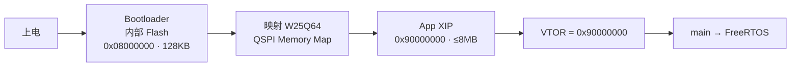

### 地址空间

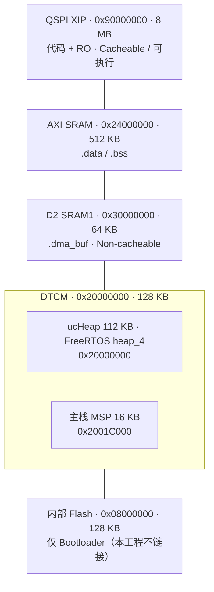

| 区域 | 基址 | 大小 | 用途 | 注意 |
|------|------|------|------|------|
| QSPI XIP | `0x90000000` | 8 MB | 代码 + RO | MPU Cache + 可执行 |
| 内部 Flash | `0x08000000` | 128 KB | Bootloader | 勿覆盖 |
| DTCM | `0x20000000` | 128 KB | heap 112KB + 栈 16KB | **DMA 不可访问** |
| AXI SRAM | `0x24000000` | 512 KB | `.data` / `.bss` | 可 Cache |
| D2 SRAM1 | `0x30000000` | 64 KB | `.dma_buf` | DMA 缓冲必须放这里 |

> DMA 缓冲请用：`__attribute__((section(".dma_buf"), aligned(32)))`  
> **禁止**在 App 中重新初始化 QSPI 或改动 QSPI 引脚（XIP 会立即失效）。

---

## 硬件概览

完整引脚、时钟、MPU 见 [`doc/hardware.md`](doc/hardware.md)。

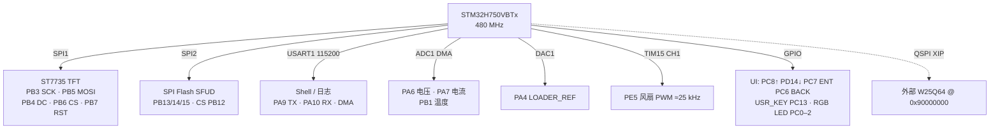

### 主要外设

| 外设 | 引脚 / 要点 |
|------|-------------|
| USART1 | PA9/PA10 · 115200 8N1 · RX/TX DMA |
| SPI1 | ST7735 · ~48 MHz 量级 · TX DMA |
| SPI2 | SPI Flash · 48 Mbps · CS=PB12 |
| ADC1 | 3 通道扫描 + DMA 循环 · V/I/Temp |
| DAC1 | PA4 · 12-bit · 负载基准 |
| TIM15 | PE5 · 风扇 PWM |
| TIM17 | HAL 1 ms 时基 |

### 时钟树（摘要）

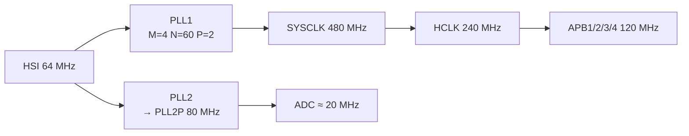

---

## 电子负载应用

目标：单通道实验板级（&lt;50W 量级），**CC / CV / CR / CP**；TFT + 按键人机，串口 CLI 调试。

设计细节：[`src/app/LOADER_DESIGN.md`](src/app/LOADER_DESIGN.md) · UI：[`src/app/LOADER_UI.md`](src/app/LOADER_UI.md)

### 模块划分

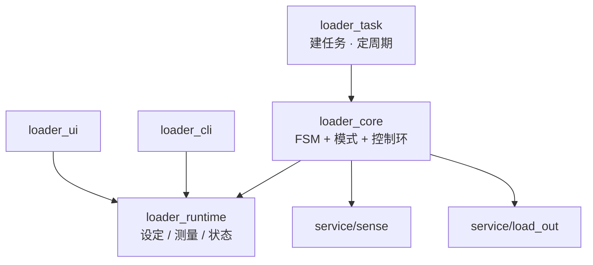

| 模块 | 职责 |
|------|------|
| `loader_config.h` | 周期、满量程、默认 PID / 限值 |
| `loader_runtime` | 共享状态（唯一真相源） |
| `loader_core` | 状态机 + 四模式 + PID；**唯一写执行器** |
| `loader_ui` / `loader_cli` | 只改设定、只读 runtime |
| `loader_task` | FreeRTOS 任务与周期调度 |

### 状态机

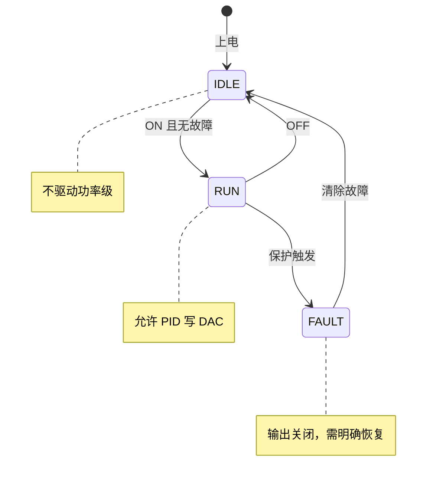

### 控制策略

内环统一做**电流**；CV / CR / CP 只算 `I_target`。

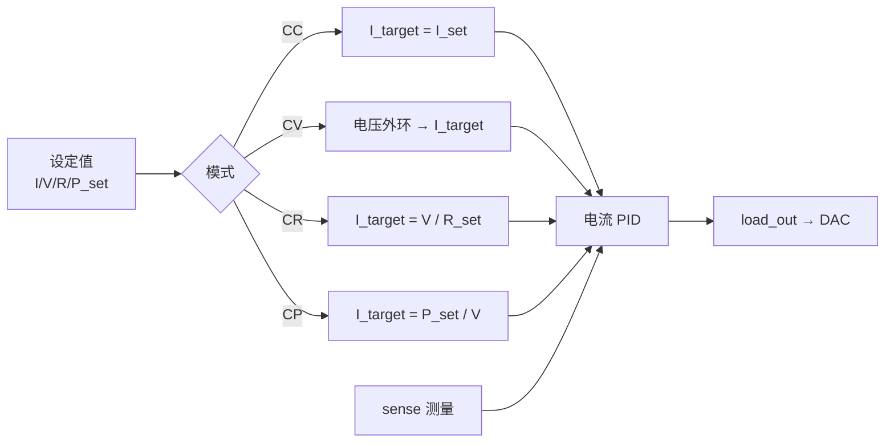

| 模式 | `I_target` 来源 |
|------|-----------------|
| **CC** | `I_set` |
| **CV** | 电压外环（或限流） |
| **CR** | `V_meas / R_set` |
| **CP** | `P_set / V_meas` |

---

## 启动流程（软件）

`defaultTask` 只调 `app_start()`：

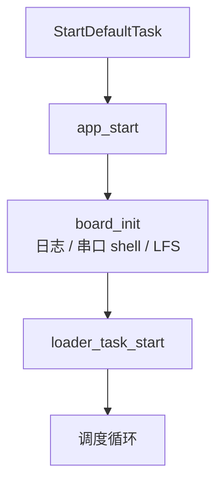

`main` 在 RTOS 启动前调用 `board_early_init()`（SPI Flash dummy）。

---

## 编译与下载

工具链：**Keil MDK-ARM**（`MDK-ARM/BaseFramework.uvprojx`）。

### 编译

```powershell
$uv4 = "C:\Users\yuang\AppData\Local\Keil_v5\UV4\UV4.exe"
$proj = "D:\Project\H750\BaseFramework\MDK-ARM\BaseFramework.uvprojx"
$log  = "D:\Project\H750\BaseFramework\MDK-ARM\build_output.txt"

$proc = Start-Process -FilePath $uv4 `
  -ArgumentList "-b", $proj, "-o", $log `
  -PassThru -Wait -NoNewWindow
Write-Host "Exit code: $($proc.ExitCode)"
Get-Content $log | Select-Object -Last 5
```

成功标志：日志中出现 **`0 Error(s)`**。

### 下载

使用外部 Flash FLM 烧写到 **`0x90000000`**，不要覆盖内部 Bootloader。

```powershell
$proc = Start-Process -FilePath $uv4 `
  -ArgumentList "-f", $proj `
  -PassThru -Wait -NoNewWindow
```

---

## CubeMX 约定

| 区域 | 策略 |
|------|------|
| `Core/Src/*.c`、`Core/Inc/*.h` | 修改只放在 `USER CODE BEGIN/END` |
| `FreeRTOSConfig.h`、`stm32h7xx_hal_conf.h` | 同上 |
| `MDK-ARM/*.uvprojx` | CubeMX 会覆盖；需手动恢复 SEGGER 组与 include |
| `src/**`、`Core/**/SEGGER/**` | 用户自由文件，CubeMX 不碰 |

重新生成工程后，检查：

1. Include 含 `../Core/Inc/SEGGER`
2. 工程组 `Application/User/SEGGER` 源文件在
3. 自定义 scatter（`BaseFramework.sct`）与 `APPLICATION_ADDRESS=0x90000000U`

---

## FreeRTOS 默认配置

| 项 | 值 |
|----|-----|
| 调度 | 抢占式 |
| 堆 | heap_4 · **112 KB @ DTCM**（`ucHeap`） |
| 主栈 | 16 KB @ DTCM |
| Tick | 1 kHz |
| 优先级 | 56 |
| 默认任务 | `defaultTask` · `osPriorityNormal` · 栈 512×4 字节 |
| Trace | SEGGER SystemView（`SEGGER_SYSVIEW_FreeRTOS.h`） |

---

## 相关文档

| 文档 | 说明 |
|------|------|
| [`doc/hardware.md`](doc/hardware.md) | 引脚、时钟、MPU、内存、外设参数（硬件权威） |
| [`src/app/LOADER_DESIGN.md`](src/app/LOADER_DESIGN.md) | 电子负载分层与控制设计 |
| [`src/app/LOADER_UI.md`](src/app/LOADER_UI.md) | UI 交互 |
| [`AGENTS.md`](AGENTS.md) / [`Claude.md`](Claude.md) | AI 助手工程约定 |

---

## License

以仓库内各组件自带许可证为准（ST HAL、FreeRTOS、Adafruit、SEGGER 等第三方库请遵循其原始协议）。本框架应用层代码用途请按项目需要自行约定。
